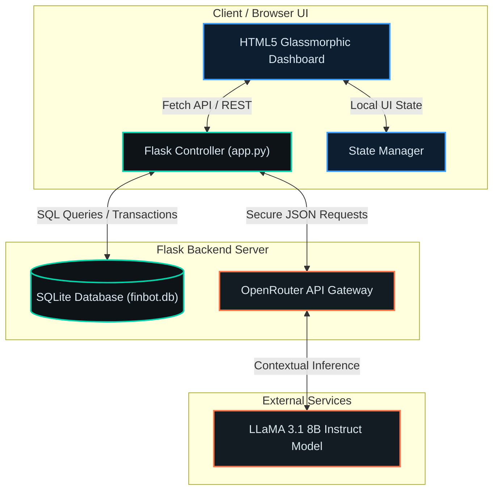

<p align="center">
  
</p>

<h1 align="center">🤖 FinBot</h1>
<p align="center">
  <strong>An elegant, AI-powered financial companion that translates your transaction ledger into actionable financial insights in real-time.</strong>
</p>

<p align="center">
  <a href="LICENSE"></a>
  <a href="https://github.com/joeflaming777-lgtm/finance-project-/stargazers"></a>
  <a href="https://github.com/joeflaming777-lgtm/finance-project-"></a>
  <a href="https://github.com/joeflaming777-lgtm/finance-project-"></a>
</p>

---

## 💡 The "Why"

Traditional finance applications present you with cold, flat spreadsheets and leave the heavy lifting of budgeting, analysis, and strategic spending adjustments to you. **FinBot** changes the paradigm. 

By combining a robust, local transaction ledger database with an advanced LLM reasoning engine, FinBot offers an interactive, double-entry financial command center. Instead of hunting through rows of numbers, you can **converse directly with your financial statement** using natural language, receive real-time intelligence on your monthly savings rate, and immediately discover optimization strategies. It's your ledger, data visualizer, and financial advisor, unified in a single, high-performance interface.

---

## 🛠️ Tech Stack Grid

FinBot is built using a clean, modern, and highly modular technology stack optimized for low-latency operations and clear visual hierarchy.

| Layer | Technologies & Tools | Key Role |
| :--- | :--- | :--- |
| **Frontend** | `HTML5`, `CSS3 Variables`, `Space Grotesk & JetBrains Mono Fonts` | High-fidelity glassmorphic dashboard, responsive layout, real-time charts, SVG gauges, and animations. |
| **Backend** | `Flask (Python)`, `Requests`, `Python-Dotenv` | RESTful API controllers, routing, environment isolation, and proxy coordination. |
| **Database** | `SQLite`, `UUIDv4` | Relational transactional persistence, index optimization, and secure unique primary keys. |
| **AI Reasoning** | `OpenRouter API`, `LLaMA 3.1 8B Instruct` | Natural Language Processing (NLP), contextual budgeting analysis, and conversational intelligence. |

---

## ✨ Key Features Carousel

*   🤖 **Conversational AI Financial Advisor**  
    *Directly converse with LLaMA 3.1 about your ledger. Ask questions like "Which categories am I overspending on?" or "How can I improve my financial score this month?"*
*   📊 **Dynamic Financial Health Scorecard**  
    *Receive instant visual feedback on your budget's efficiency. The dashboard dynamically updates a vector SVG-rendered gauge showing your score (0-100) and letter grade (A+ through F).*
*   💸 **Zero-Configuration SQLite Transaction Ledger**  
    *Full CRUD capabilities to add, track, and delete records. Transactions are instantly validated on the backend and persistent across sessions.*
*   🎨 **Premium Cyber-Theme Visual Experience**  
    *Designed with a custom-engineered color palette—neon teal (#00d4aa), electric blue (#3b9eff), and coral (#ff7043) accents—enhanced by micro-animations and glowing indicators.*
*   🏷️ **Smart Categorization & Analytics**  
    *Autodetects top spending categories, tracks cumulative savings rate, and charts total inflows and outflows dynamically.*

---

## ⚡ Quick Start / Interactive Tour

Ready to run your personal AI financial advisor locally? Follow these steps:

### 1. Clone & Navigate
```bash
git clone https://github.com/joeflaming777-lgtm/finance-project-.git
cd finance-project-
```

### 2. Set Up Virtual Environment (Recommended)
```bash
# Create a virtual environment
python -m venv venv

# Activate it:
# On Windows (PowerShell):
.\venv\Scripts\Activate.ps1
# On macOS/Linux:
source venv/bin/activate
```

### 3. Install Dependencies
```bash
pip install -r requirements.txt
```

### 4. Configure Environment Variables
Copy the template `.env.example` file and insert your OpenRouter API key:
```bash
copy .env.example .env   # Windows
# or
cp .env.example .env     # macOS/Linux
```
Open `.env` in your editor and input your key:
```env
OPENROUTER_API_KEY=your_actual_api_key_here
```

### 5. Launch the Server
```bash
python app.py
```
> [!TIP]
> The server will start on [http://127.0.0.1:5000](http://127.0.0.1:5000). Simply open this link in your browser to launch the web client!

---

## 🏗️ Architecture & How It Works

FinBot leverages a decoupled architecture where transaction management and AI capabilities communicate securely over a clean REST API. Here is the operational data flow:



1. **Transaction Entry**: User submits a new transaction on the frontend. The transaction is validated and saved to SQLite database.
2. **Real-time Analytics**: The backend calculates total balance, savings rate, and financial health score, instantly returning the aggregated stats to update the frontend graphs.
3. **AI Chat Loop**: When the user chats with the AI, the frontend sends the conversation history along with current ledger metrics to the backend. Flask proxies this securely with context to LLaMA 3.1 via OpenRouter.

___

## 📄 License

Distributed under the MIT License. See [LICENSE](LICENSE) for more information.

<p align="center" style="margin-top: 50px; opacity: 0.5; font-size: 11px;">
  Built with 💻, ☕, and 🤖 by Antigravity and the FinBot contributors.
</p>
